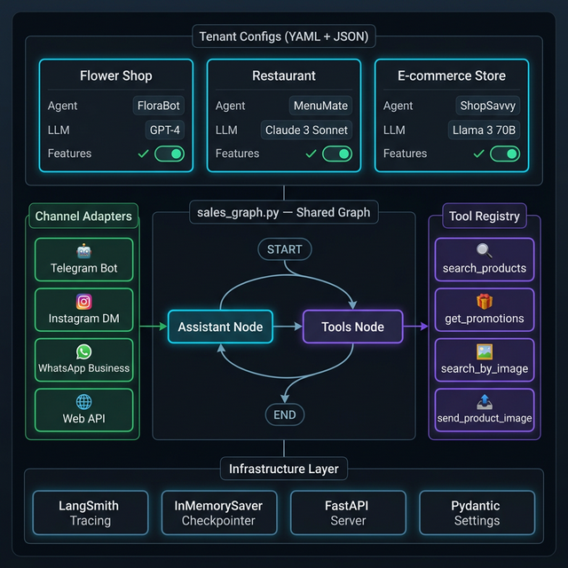

<div align="center">

# 🤖 Enterprise Sales Agent

**Multi-tenant AI sales agent framework powered by LangGraph**

*One codebase → infinite businesses → any messaging channel*

[](https://python.org)
[](https://github.com/langchain-ai/langgraph)
[](LICENSE)
[]()
[]()

</div>

---

## What is this?

A production-ready, open-source framework for building **AI sales agents that serve multiple businesses** from a single deployment. Each business (tenant) gets their own branded agent personality, product catalog, and LLM config — all wired up to Telegram, Instagram, WhatsApp, and your web app simultaneously.

Think of it as **SalesGPT** but with proper multi-tenancy, channel adapters, and a repository pattern for clean data access.

```
Customer on Telegram → Flower Shop's "Aigul" (GPT-4o-mini, ru) → searches catalog → sends product images
Customer on WhatsApp → Restaurant's "Marco" (Claude Sonnet, en) → shows menu + promotions
Customer on Web      → E-commerce "Alex" (Llama 3, en) → visual product search
```

---

## Built in the real world

This isn't a tutorial project. I've been building AI sales agents for real businesses — flower shops, restaurants, e-commerce stores. Every client starts with this exact codebase, and I add integrations on top.

The pattern is always the same:
1. Drop a `config.yaml` with the business persona and rules
2. Load the product catalog into `products.json`
3. Connect the channel (usually Telegram first, then Instagram/WhatsApp)
4. Go live in a day

This repo is the starting point I keep coming back to — so I'm open-sourcing it.

> **Need to deploy this for your business?**
> Reach out → [github.com/yerdaulet-damir](https://github.com/yerdaulet-damir) or open an issue describing your use case.

---

## Architecture



The core is a **shared LangGraph graph** that drives every tenant's agent. Tenant YAML configs inject the personality, tools, and LLM at runtime — no code changes needed to add a new business.

```
                    ┌─────────────────┐
                    │  Tenant Config  │  ← config.yaml + products.json
                    │  (YAML + JSON)  │    per business in /tenants/
                    └────────┬────────┘
                             │
          ┌──────────────────▼──────────────────┐
          │         LangGraph Sales Graph        │
          │                                      │
          │   START → [Assistant] ⇄ [Tools] → END│
          │                                      │
          └──────────────────────────────────────┘
                  ↑                        ↑
    ┌─────────────┴──────┐    ┌────────────┴──────────────┐
    │  Channel Adapters  │    │       Tool Registry        │
    │  • Telegram Bot    │    │  • search_products         │
    │  • Instagram DM    │    │  • get_promotions          │
    │  • WhatsApp        │    │  • search_by_image  🖼️    │
    │  • Web / FastAPI   │    │  • send_product_image      │
    └────────────────────┘    └───────────────────────────┘
```

---

## Why not just use SalesGPT, TaskingAI, or AutoGPT?

| Feature | **This Project** | SalesGPT | TaskingAI | AutoGPT |
|---|---|---|---|---|
| Multi-tenant YAML configs | ✅ Drop a folder, done | ❌ | ✅ (complex SaaS) | ❌ |
| LangGraph native (async, streaming) | ✅ | ❌ custom | ❌ | ❌ |
| Channel adapters (TG/IG/WA/Web) | ✅ Built-in | ❌ | ⚠️ via API | ❌ |
| Image search / visual catalog | ✅ | ❌ | ❌ | ❌ |
| Switch LLM per tenant (OpenAI/Anthropic) | ✅ | ❌ | ✅ | ❌ |
| LangSmith tracing out of the box | ✅ | ❌ | ❌ | ❌ |
| `pip install` + YAML = live agent | ✅ | ❌ | ❌ | ❌ |
| Open source, no SaaS lock-in | ✅ | ✅ | ❌ | ✅ |
| Stars ⭐ | growing 🌱 | ~1.2k | ~5.1k | ~177k |

**The pitch**: AutoGPT is powerful but general. SalesGPT is focused but doesn't scale to multiple businesses. TaskingAI is SaaS. **This project solves exactly the multi-tenant sales bot problem** with ~500 lines of clean Python.

---

## Project Structure

```
enterprise-agents/sales/
├── src/
│   ├── channels/              # Channel adapters
│   │   ├── telegram/          # Telegram Bot polling
│   │   ├── instagram/         # Instagram DM webhook
│   │   ├── whatsapp/          # WhatsApp Business API
│   │   └── web/               # FastAPI + WebSocket
│   ├── graphs/
│   │   └── sales_graph.py     # ⭐ Core LangGraph graph
│   ├── nodes/
│   │   ├── assistant.py       # LLM node (builds prompt, routes)
│   │   └── tool_executor.py   # Tool execution node
│   ├── tools/                 # LangChain tools
│   │   ├── search_products.py
│   │   ├── get_promotions.py
│   │   ├── search_by_image.py
│   │   └── send_product_image.py
│   ├── repositories/
│   │   └── base.py            # Repository Protocol (swap storage easily)
│   ├── config/
│   │   ├── settings.py        # Global env-var settings (Pydantic)
│   │   ├── tenant_config.py   # YAML tenant loader
│   │   └── llm_provider.py    # OpenAI / Anthropic factory
│   ├── models/
│   │   └── product.py         # Product datamodel
│   └── state/
│       └── agent_state.py     # LangGraph state schema
├── tenants/
│   └── flower_shop/           # Example tenant
│       ├── config.yaml        # Agent name, LLM, language, rules
│       └── products.json      # Product catalog
├── main.py                    # CLI chat interface for testing
├── langgraph.json             # LangGraph Studio config
└── .env.example               # Copy to .env and fill in your keys
```

---

## Quickstart

### 1. Clone & install

```bash
git clone https://github.com/YOUR_USERNAME/enterprise-sales-agent
cd enterprise-sales-agent

python -m venv .venv && source .venv/bin/activate
pip install -e .
```

### 2. Set up environment

```bash
cp .env.example .env
# Edit .env and add your API keys:
# ANTHROPIC_API_KEY=sk-ant-...
# OPENAI_API_KEY=sk-...
# LANGCHAIN_API_KEY=ls__...  (optional, for LangSmith tracing)
```

### 3. Run the CLI demo

```bash
python main.py
```

You'll see a tenant picker, then start chatting with the flower shop's AI consultant:

```
🏪 Available tenants:
   1. flower_shop — Розы & Букеты (agent: Айгуль)

You: Show me red roses
Айгуль: Let me search for red roses for you... 🌹
[calls search_products → returns catalog results]
Айгуль: Here are our beautiful red roses! We have...
```

### 4. (Optional) Launch in LangGraph Studio

```bash
langgraph dev
```

Open Studio UI at `http://localhost:8124` — full visual graph debugger with state inspection.

---

## Adding a New Tenant

1. Create a folder in `/tenants/your_business/`
2. Add `config.yaml`:

```yaml
tenant_id: "your_business"
business_name: "Your Store Name"
language: "en"

agent:
  name: "Alex"
  role: "Sales Assistant"
  personality: |
    You are Alex, a friendly assistant at Your Store.
    You help customers find the perfect products.
  rules:
    - Always greet warmly
    - Suggest upsells when appropriate
    - Never confirm payment yourself

llm:
  provider: "anthropic"      # or "openai"
  model: "claude-3-5-sonnet-20241022"
  temperature: 0.7
  max_tokens: 1024

features:
  image_search: true
  promotions: true
  upsell: true
```

3. Add `products.json` with your catalog — that's it. No code changes.

---

## Channels

| Channel | Status | Notes |
|---|---|---|
| CLI (testing) | ✅ Ready | `python main.py` |
| Web / FastAPI | ✅ Ready | REST + WebSocket |
| Telegram Bot | ✅ Ready | Long polling + webhooks |
| Instagram DM | ✅ Ready | Messenger API webhook |
| WhatsApp Business | ✅ Ready | Cloud API webhook |

---

## Configuration Reference

### `.env` (required)

```bash
# At least one LLM provider key is required
OPENAI_API_KEY=your-key
ANTHROPIC_API_KEY=your-key

# LangSmith (optional but highly recommended)
LANGCHAIN_TRACING_V2=true
LANGCHAIN_API_KEY=your-langsmith-key
LANGCHAIN_PROJECT=sales-agent
```

### `tenants/{name}/config.yaml`

| Key | Required | Default | Description |
|---|---|---|---|
| `tenant_id` | ✅ | — | Unique ID matching folder name |
| `business_name` | ✅ | — | Shown in system prompt |
| `language` | ✅ | — | `en`, `ru`, `kk`, etc. |
| `agent.name` | ✅ | — | Agent persona name |
| `agent.role` | ✅ | — | Role description |
| `agent.personality` | ✅ | — | Free-form prompt injection |
| `agent.rules` | ✅ | — | List of hard rules |
| `llm.provider` | ✅ | — | `openai` or `anthropic` |
| `llm.model` | ✅ | — | Model ID |
| `features.image_search` | ❌ | false | Enable visual product search |
| `features.promotions` | ❌ | false | Enable promotions tool |

---

## Tech Stack

| Layer | Technology |
|---|---|
| Agent framework | [LangGraph](https://github.com/langchain-ai/langgraph) 0.4+ |
| LLM providers | OpenAI, Anthropic (swappable per tenant) |
| Config | Pydantic v2 + PyYAML |
| Web server | FastAPI + Uvicorn |
| Tracing | LangSmith |
| Python | 3.11+ |

---

## Roadmap

- [ ] PostgreSQL / Redis product repository (swap JSON backend)
- [ ] Voice channel (Telegram voice messages → STT → agent)
- [ ] Stripe payment link generation tool
- [ ] Order tracking tool
- [ ] Multi-language auto-detection
- [ ] Docker Compose deployment guide
- [ ] More tenant examples (restaurant, e-commerce)

---

## Contributing

PRs welcome! This project is intentionally small and readable — the core graph is ~50 lines. Good first issues:

- Add a new channel adapter (Discord, Viber, Line)
- Add a new tool (order status, payment link)
- Add a new tenant example
- Improve the repository pattern (PostgreSQL backend)

```bash
# Development setup
pip install -e ".[dev]"
ruff check src/        # Linting
pytest                 # Tests
```

---

## Security

- ✅ **No secrets in git** — `.env` is gitignored
- ✅ **Tenant isolation** — each tenant only sees its own products
- ✅ **No hardcoded keys** — all config via environment variables (`python-dotenv` + `pydantic`)
- ⚠️ **InMemorySaver** — conversation state is in-memory only. For production, swap with `PostgresSaver` or `RedisSaver`.

---

## License

MIT — use it, fork it, sell it, build your empire.

---

<div align="center">

Built with ❤️ using [LangGraph](https://github.com/langchain-ai/langgraph) · Inspired by the need for a **simple, hackable** multi-tenant sales bot framework

*If this helped you ship faster, star ⭐ the repo*

</div>
